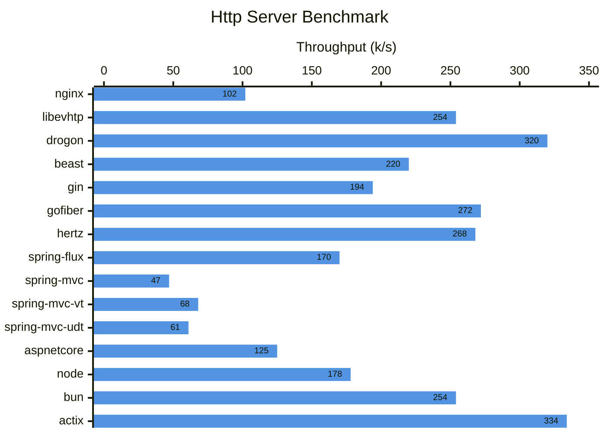

## Benchmark for Web Frameworks

See [Techempower](https://www.techempower.com/benchmarks/). This repository contains homemade benchmarks for Http servers. Only a single text response is considered, since some servers do not have their builtin Json implementation. Basically, I am benchmarking event loops, with Http implementation.

All server applications are running in a 4C docker environment, while I use [`wrk`](https://github.com/wg/wrk) as the client.

```bash
# benchmark plaintext
$ wrk -c 1000 -t 10 -d 30s http://127.0.0.1:90xx/text
```

### Environment
- Server: 4C docker
- Client: 12C host machine, AMD 7840HS, LinuxMint 22.3 / Ubuntu 24.04.
- All applications are tweaked to work with 4C.
- All Java & .NET applications are properly warmed up before benchmark.
- The userland proxy of docker is disabled to eliminate the networking bottleneck. In `/etc/docker/daemon.json`, set the value and restart docker.

```json
{
    "userland-proxy": false
}
```

### Benchmark Result

| Server                                                       | Language   |          Version | Throughput |
| ------------------------------------------------------------ | ---------- | ---------------: | ---------: |
| [nginx](https://nginx.org/)                                  | C          |           1.28.2 |    102k /s |
| [libevhtp](https://github.com/Yellow-Camper/libevhtp) ([libevent](https://github.com/libevent/libevent)) | C          |  1.2.18 / 2.1.12 |    254k /s |
| [drogon](https://github.com/drogonframework/drogon)          | C++        |            1.8.7 |    320k /s |
| [beast](https://www.boost.org/doc/libs/latest/libs/beast/doc/html/index.html) | C++        |             1.83 |    220k /s |
| [gin](https://github.com/go-gin/gin)                         | Go 1.22    |           1.10.1 |     86k /s |
| [gin](https://github.com/go-gin/gin) (`GOMAXPROCS`=4)        | Go 1.22    |           1.10.1 |    194k /s |
| [gofiber](https://github.com/gofiber/fiber)                  | Go 1.22    |          2.52.12 |     98k /s |
| [gofiber](https://github.com/gofiber/fiber) (`GOMAXPROCS`=4) | Go 1.22    |          2.52.12 |    272k /s |
| [hertz](https://github.com/cloudwego/hertz)                  | Go 1.22    |           0.10.4 |    138k /s |
| [hertz](https://github.com/cloudwego/hertz) (`GOMAXPROCS`=4) | Go 1.22    |           0.10.4 |    268k /s |
| [spring-webflux](https://github.com/spring-projects/spring-boot) ([netty](https://netty.io/)) | Java 21    | 3.5.10 / 4.1.130 |    170k /s |
| [spring-webmvc](https://github.com/spring-projects/spring-boot) ([tomcat](https://tomcat.apache.org/)) | Java 21    | 3.5.10 / 10.1.50 |     47k /s |
| [spring-webmvc](https://github.com/spring-projects/spring-boot) ([tomcat](https://tomcat.apache.org/) with virtual thread) | Java 21    | 3.5.10 / 10.1.50 |     68k /s |
| [spring-webmvc-undertow](https://github.com/undertow-io/undertow) | Java 21    |  3.5.10 / 2.3.22 |     61k /s |
| [aspnetcore](https://github.com/dotnet/aspnetcore)           | .NET 10    |             10.0 |    125k /s |
| [node](https://github.com/nodejs/node)                       | Javascript |            24.14 |    178k /s |
| [bun](https://github.com/oven-sh/bun)                        | Javascript |   24.14 / 1.3.10 |    254k /s |
| [actix](https://github.com/actix/actix-web)                  | Rust 1.75  |           4.12.1 |    334k /s |



It is amazing that `actix` in rust wins the first price. It runs even faster than any C or C++ servers.

Then, `drogon` is the second. It is also an application level framework. `nginx` is here for reference. `libevhtp` is not actively maintained and somehow hard to use. `beast` from `boost` is just another choice in C++. In my previous benchmark, I can remember it did not scale well and got a much lower throughput. It got almost same throughput running in a 4C and 24C Linux machine. Not knowing why, maybe It was running on an outdated CPU and OS(CentOS 7).

In the Go world, all 3 frameworks give competitive throughput. Setting `GOMAXPROCS` makes large difference in performance. Starting 1.25, Go automatically detects and respects docker CPU limits to set `GOMAXPROCS`.

Java servers all have bad performance. `spring-webmvc` gives the worst performance by default. It does get better when switching to use `undertow` or the virtual thread feature introduced in Java 21, but no so much. There is almost no difference when running under Java 21 and Java 25 in this case, regarding [JEP 491](https://openjdk.org/jeps/491)(Synchronize Virtual Threads without Pinning). `spring-webflux` gives the best performance. The drawback is that, it is hard to write and debug reactive code. The Java world seems to have chosen virtual thread, say stackful coroutine, as their future of non-blocking programming. Even Spring has deprecated their [`reactor-kafka`](https://spring.io/blog/2025/05/20/reactor-kafka-discontinued) component. By the way, Java detects the docker environment with limited CPU resource. It not necessary to set IO or worker count manually for these servers.

Regarding ASP .NET Core, it beats only Java servers.

Regarding Javascript, both vanilla `node` and `bun` servers run smooth. They both have higher throughput than Java and .NET servers.

The benchmark only evolves event loop with Http implementation, without any business logics. The QPS can decrease dramatically if cross-service calls or database operations are added in a real-world application. But the benchmark does expose difference among languages and their potentials.

Maybe it time to say goodbye to Java and .NET in 2026. I almost have no knowledge about rust, so I think Go frameworks can be the first choice for application-level servers, as they are easier to get started.

